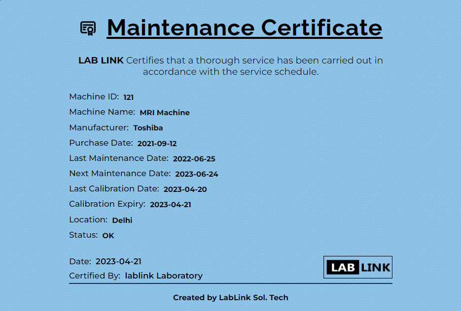
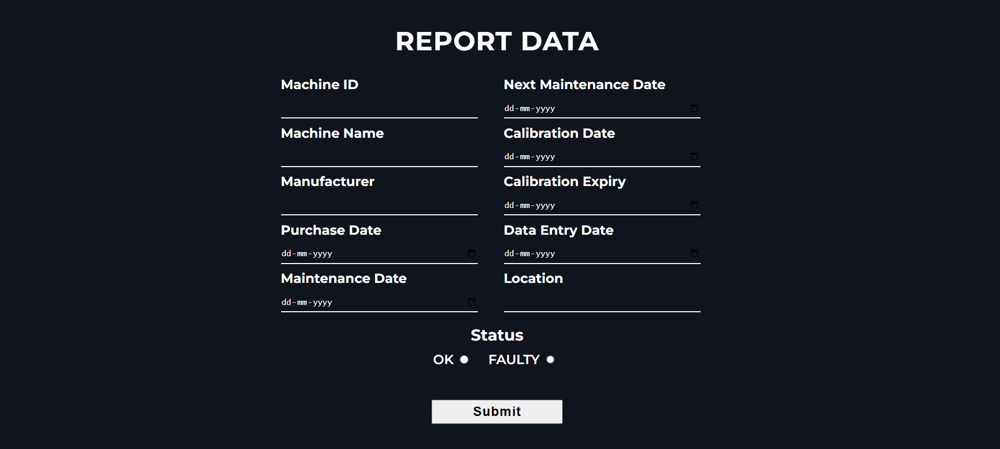

# LAB LINK

## Description
Using a QR code-based system that gives patients access to information about the testing equipment used in medical facilities will solve the issue of medical negligence caused by defective testing equipment in India. 
Patients can scan the QR codes that can be printed on each machine to learn details like the unit's purchase date, purchase history, and maintenance schedules.
This information can be made available to patients through a website or mobile app, making it easier for them to check the accuracy of their medical reports and take educated decisions regarding their health.
By increasing testing process transparency, our approach enables people to make wise healthcare decisions.
It also encourages medical facilities to constantly maintain and update their equipment, minimising the occurrence of medical errors brought on by malfunctioning machinery. 
Patients can access information about the testing equipment used in medical facilities. 
Furthermore, the approach could potentially serve to minimise the occurrence of medical malpractice litigation and enhance the general quality of healthcare in India.

## Problem Statement
In India, the lack of transparency in the medical scanning procedure has contributed to numerous cases of medical negligence resulting in death. This lack of transparency can prevent proper diagnosis and can lead to the use of faulty or outdated testing apparatus, producing inaccurate medical reports. This can cause serious repercussions, as the incorrect diagnosis can lead to incorrect treatment and can even be fatal. The negligence of medical staff to utilize updated technology and efficient testing procedures can have dire consequences, and it is essential that the medical scanning procedure is made more transparent in order to prevent further cases of medical negligence.

## Solution
The solution to the problem of medical negligence due to faulty testing equipment in India is to implement a QR code-based system that provides patients with access to information about the testing machines used in medical facilities. 
The QR codes can be placed on each machine and can be scanned by patients to obtain information such as the machine's maintenance history, purchase date, and servicing schedules. 
This information can be made available to patients through a website or mobile app, making it easier for them to verify the accuracy of their medical reports and take informed decisions regarding their health.

## Advantages
* Here are some advantages of the proposed solution in bullet points:
* Increased transparency in the medical testing process
* Provides patients with access to information about testing equipment used in medical facilities
* Helps patients verify the accuracy of their medical reports
* Encourages medical facilities to maintain and update their equipment regularly
* Reduces the incidence of medical errors caused by faulty machines
* Improves the overall quality of healthcare in India
* Potential to reduce the incidence of medical malpractice lawsuits

## Working Model
### Certification page:

### Data Updation page:

